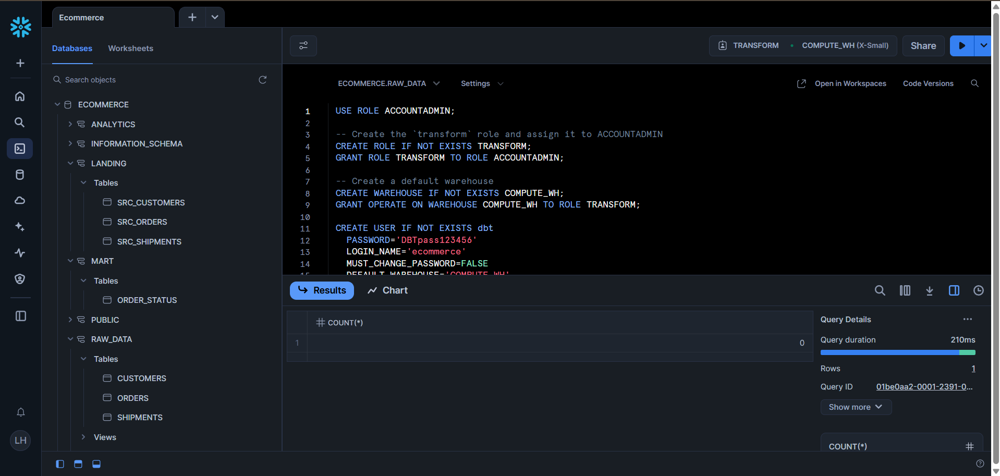
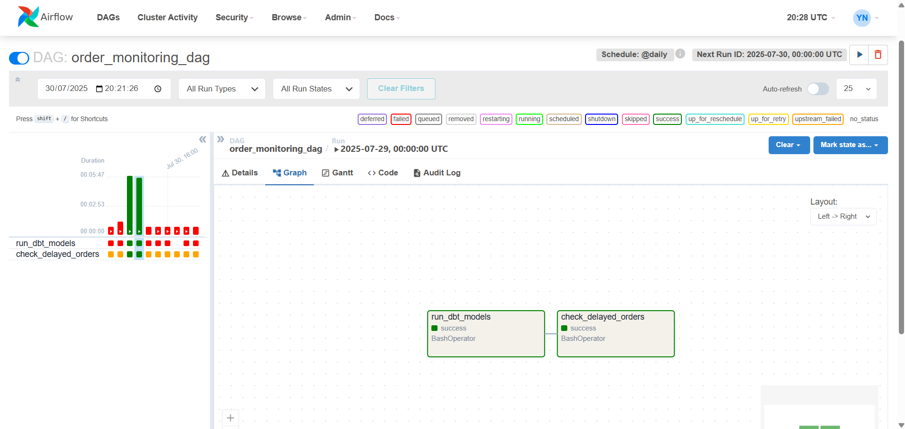

This project demonstrates a foundational data pipeline from the source through transformation and orchestration.

**Data Pipeline Overview:**

1. **E-commerce Data (Dummy)**: initially generated using `Python` which includes orders, customers and shipments information.

2. **Raw Data**: The generated raw data is then ingested and stored in `Snowflake`, serving as our cloud data warehouse for raw and untransformed datasets.

3. **Transform Data**: `DBT` is used to transform, clean, and model the data within Snowflake, preparing it for analysis.

4. **Orchestration**: The transform of Data as well as the check corresponded are orchestrated using `Apache Airflow`, which ensures the automated scheduling, execution, and monitoring of data processes.
