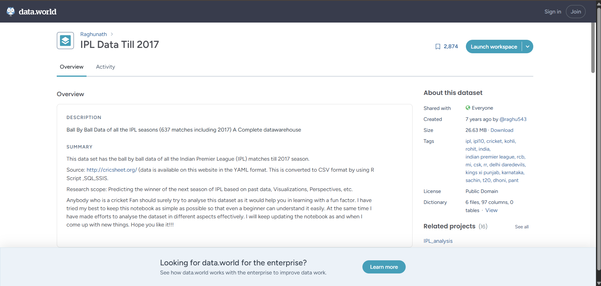
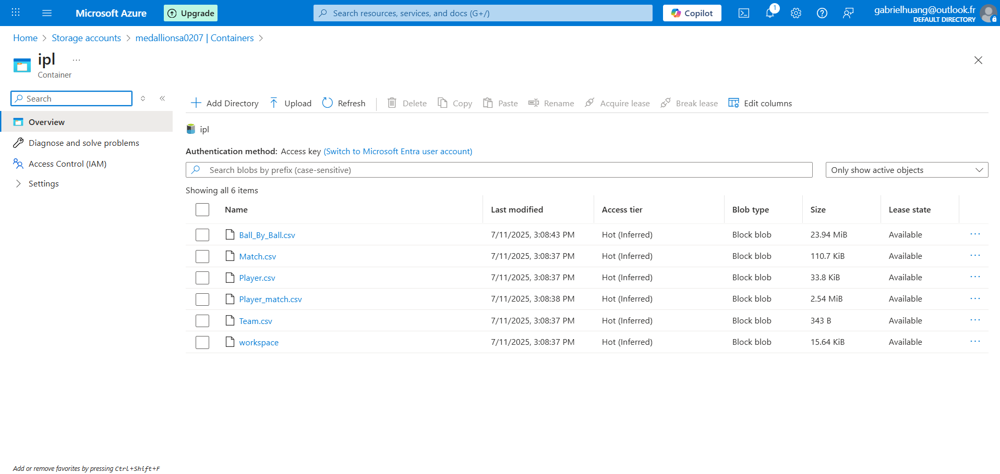
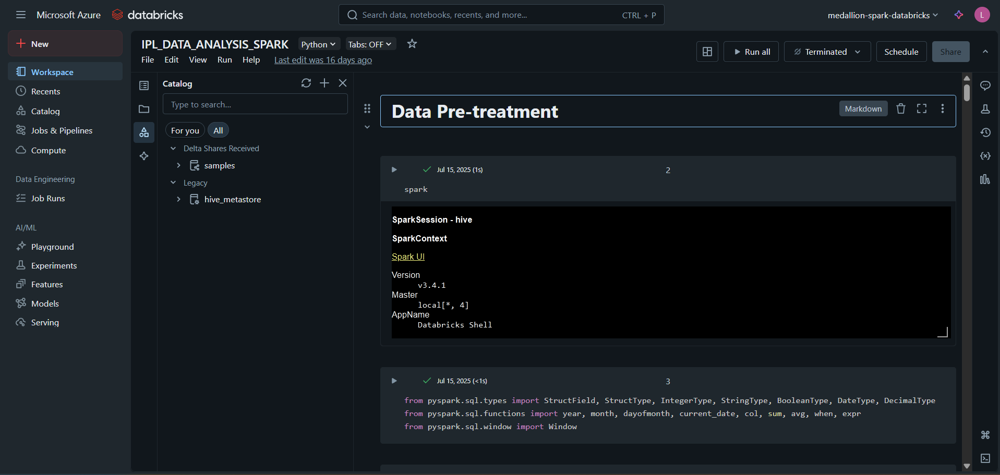

This project focuses on analyzing Cricket Data using the [`IPL dataset`](https://data.world/raghu543/ipl-data-till-2017).

**Data Pipeline Overview**:

1. `Online Dataset`: The raw data is sourced from the `Data World` website.

2. `Raw Data`: The raw data extracted from the online dataset is then stored in `Azure Storage Account`. This stage represents the initial landing zone for unprocessed information.

3.`Data Transformation`: The raw data undergoes a transformation process. This step uses `PySpark` for distributed data processing and is executed within a cloud environment, leveraging Microsoft Azure services and Databricks for scalable analytics.  
4.`Data Visualization`: Finally, some simple statistical visualizations are generated directly by the Python plot packages. This stage aims to create insightful representations of the data, enabling analysis.

The steps 2-4 are executed in `Databricks`.
