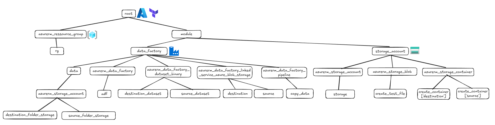

## My_Portfolio
This repository showcases my personal data projects, each utilizing different tools across various stages of data processing:
* **IPL_DATA_ANALYSIS**: This project involves a comprehensive analysis of sports data, leveraging the computing capabilities of `Databricks` and `Spark` to extract insights and trends, with the data being stored in `Azure Storage Accounts`.
* **NetflixDBT**: This project focuses on building a robust data pipeline for movie data, integrating various cloud technologies such as `AWS S3` for raw data storage, `Snowflake` as a data warehouse, `DBT` for data transformation, and `Power BI` for data visualization.

* **Moderne_DE_CICD**: Incorporating `CI/CD`, this architecture leverages `Terraform` to declaratively provision and manage the `Azure` data pipeline components (`Resource Groups`, `Storage Accounts`, `Data Factory`), enabling automated and consistent deployments.

* **PowerBI**: This project showcases a versatile collection of data visualization templates, all meticulously designed and created using `Power BI` to present complex data in an intuitive and interactive manner.
    * **Banking Churn**: This dashboard offers a comprehensive analysis of banking customer churn and its distribution according to various segmentation criteria, providing multi-faceted insights for retention strategies.
    
    * **Finance KPI**: This dashboard provides an executive overview of sales performance, tracking total sales against targets, variance, and month-over-month trends.
    