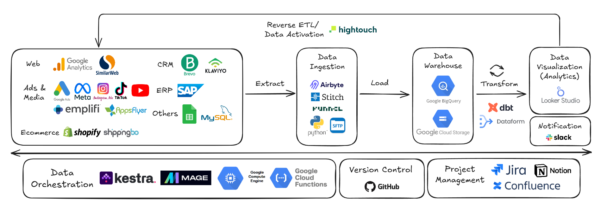
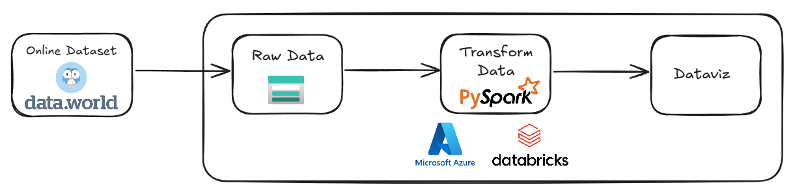
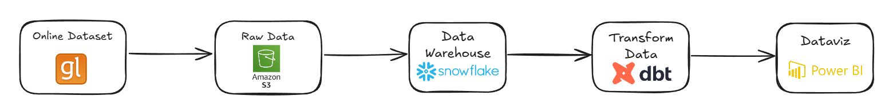
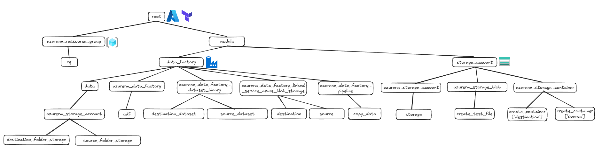
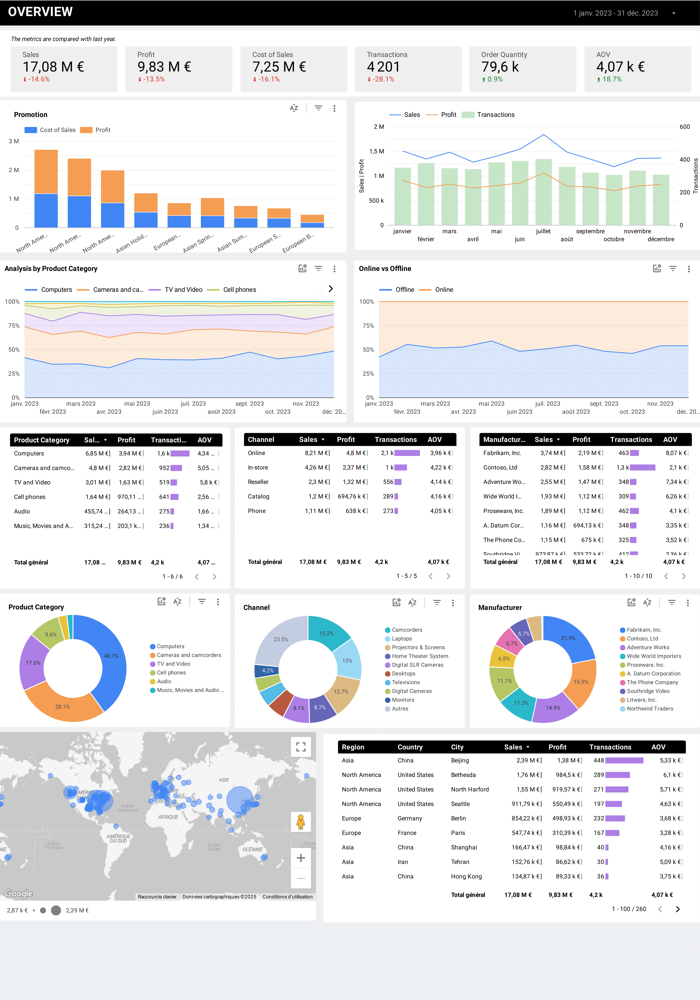

# My_Portfolio
This repository showcases my data projects, each utilizing different tools across various stages of data processing.  
Here is a simple overview of the data stacks concerned:  
- Professional environment:
  - Diverse marketing/business tools
  - `E (Extract)`: Data Connectors (`Airbyte`, `Stitch`, `Funnel`), `Python`, `SFTP`
  - `L (Load)`: `BigQuery`, `Google Cloud Storage`
  - `T (Transform)`: `DBT`, `Dataform` 
  - `Dataviz`: `Looker Studio`, `Looker`, `Spotfire`
  - `Orchestration`: `Kestra`, `Mage`, `Google Cloud Function`, `Google Compute Engine`
  - `Version Control`: `Github`
  - `Project Management`: `JIRA`, `Confluence`, `Notion`
- Personal exploration:
  - `Cloud`: `Azure`, `AWS`, `Snowflake`
  - `L (Load)`: `Azure Storage Account`, `Azure Data Factory`, `AWS S3 Bucket`
  - `T (Transform)`: `PySpark`,`Databricks`
  - `Dataviz`: `Power BI`
  - `Orchestration`: `Airflow`
  - `Infrastructure`: `Terraform`, `Azure Resource Group`

## Professional Environment
### Templates ###
This project contains `SQL` queries, `DBT` models, `Python` scripts, and `Kestra` workflow files. These assets are specifically designed to illustrate common analytical methodologies and data processing practices within my working environment. All queries and `DBT` models are developed to run efficiently within a `Google Cloud Platform` environment, leveraging its robust capabilities for large-scale data processing. The content is meticulously categorized by the type of analysis or the primary tool used, ensuring clarity and ease of navigation.

*Please note: All sensitive information, proprietary data, and company-specific identifiers have been meticulously removed and abstracted to ensure strict compliance with confidentiality agreements.*

This workflow diagram visually outlines the different stages of the data lifecycle within my working environment, from raw data acquisition to refined insights and operational activation:

- `E (Extract)`: Data sources identification is driven by specific analytical project needs. We extract diverse types of data from various business domains, including web analytics, advertising campaigns, media consumption, e-commerce transactions, CRM systems, ERP platforms, and more. Raw data from these identified sources is then extracted and prepared for loading into our data warehouse. This stage employs a range of methods:

  - `Data Connectors`: Principally using tools like `Airbyte`, `Funnel`, and `Stitch` for automated integrations.

  - `Python Scripts`: developed for direct extraction from `API` endpoints, `SFTP` servers, and other custom data sources.

- `L (Load)`: All ingested data is loaded and securely stored within  Data Warehouse. Our primary storage solutions for this stage are `Google BigQuery` for structured and semi-structured data, and `Google Cloud Storage` for raw or unstructured data.

- `T (Transform)`: Once data resides in the warehouse, it undergoes a crucial transformation phase. This stage focuses on ensuring data quality, cleaning, and modeling. The goal is to convert it into standardized, analytics-ready formats that facilitate efficient reporting and analysis. This is primarily achieved by leveraging `DBT` for most transformation pipelines, supplemented by `Dataform` for specific use cases.

Transformed data is then leveraged for various analytical and operational purposes, driving business value:

  - `Data Visualization`: We create interactive dashboards and reports using tools such as `Looker Studio` to provide actionable business intelligence and insights for decision-making.

  - `Reverse ETL / Data Activation`: Critical insights and enriched data are pushed back into operational systems, such as CRM or advertising platforms, through solutions like `Hightouch`. This enables direct business actions, personalized customer experiences, and optimized campaigns.

  - `Notifications`: Automated alerts and notifications are configured via `Slack` to inform relevant stakeholders based on data-driven insights or anomalies.

Other Stages and Tools Ensuring Daily Operations:
Beyond the core data flow, several supporting functions and tools are essential for the daily execution and management of our data platform:

- `Data Orchestration`: This ensures the automated and scheduled execution of data pipelines, managing complex dependencies and workflows across the entire platform. We primarily use `Kestra` for this purpose. Additionally, `Mage` and `Google Cloud Functions` are utilized for specific orchestration needs. `Kestra` and `Mage` are typically deployed on `Google Compute Engine` instances to integrate seamlessly with the Google Cloud environment.

- `Version Control`: All code assets, including data pipeline definitions, transformation logic, and supporting documentation, are rigorously managed under version control using `GitHub`. This practice facilitates collaborative development, tracks changes, and maintains high code quality standards.

- `Project Management`: We leverage a suite of tools for efficient project management, including `JIRA` for issue tracking, `Confluence` for documentation and knowledge sharing, and `Notion` for flexible task organization. These tools are utilized to organize tasks, track progress, and manage the overall lifecycle of our data projects effectively.

## Personal Exploration ##
### IPL_DATA_ANALYSIS ###
This project involves a comprehensive analysis of sports data, leveraging the computing capabilities of `Databricks` and `PySpark` to extract insights and trends, with the data being stored in `Azure Storage Accounts`.

### NetflixDBT ###
This project focuses on building a robust data pipeline for movie data, integrating various cloud technologies such as `AWS S3` for raw data storage, `Snowflake` as a data warehouse, `DBT` for data transformation, and `Power BI` for data visualization.

### Ecommerce ###
This project showcases a data pipeline, starting with dummy E-commerce Data generated by `Python`, stored in `Snowflake`, transformed using `DBT`, and orchestrated by `Airflow`.

### Moderne_DE_CICD ###
Incorporating `CI/CD`, this architecture leverages `Terraform` to declaratively provision and manage the `Azure` data pipeline components (`Resource Groups`, `Storage Accounts`, `Data Factory`), enabling automated and consistent deployments.

### Looker Studio ###
This folder showcases a collection of data visualization templates, all meticulously designed and created using `Looker Studio` to present complex data in an intuitive and interactive manner.
* **Product Analysis**: This dashboard [`(link)`](https://lookerstudio.google.com/reporting/8e126dee-86ee-4c83-8eb3-92f7f9c0b391/page/kPLTF) offers a comprehensive analysis (including profit and segment ABC) of various marketing metrics for the products, providing multi-faceted insights for product performance evaluation and strategic decision-making.

### PowerBI ###
This folder showcases a collection of data visualization templates, all meticulously designed and created using `Power BI` to present complex data in an intuitive and interactive manner.
* **Banking Churn**: This dashboard offers a comprehensive analysis of banking customer churn and its distribution according to various segmentation criteria, providing multi-faceted insights for retention strategies.

* **Finance KPI**: This dashboard provides an executive overview of sales performance, tracking total sales against targets, variance, and month-over-month trends.
