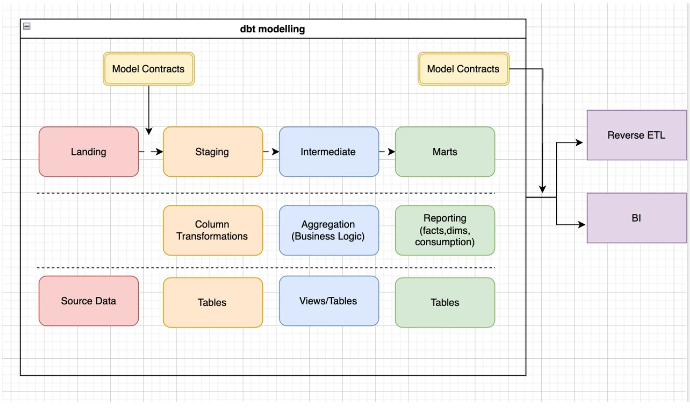

This project serves as a collection of frequently used analytical queries, scripts and data flow templates which are derived from common data analysis patterns I've encountered in professional settings, abstracted to be generalizable and reusable. __More sensitive client-specific information, as well as their own business tools and solutions tailored to individual client needs, are not included here.__ This repository is continuously being updated with new templates and refinements.

**About This Project**  
This project contains `SQL` queries, `DBT` models, `Python` scripts and `Kestra` workflow files designed to illustrate common analytical methodologies. All queries and `DBT` models are developed to run efficiently within a `Google BigQuery` environment. The contents are categorized by the type of analysis or the tool used. All sensitive information, proprietary data, and company-specific identifiers have been meticulously removed and abstracted to ensure compliance with confidentiality agreements.

**Structure and Contents**  
The project is structured to reflect different stages of data transformation and analysis, as well as specific domain applications.
- `DBT`: `DBT` models for different usecases in different tools, respecting defined layers as illustrated in the following figure:

    - `Google Analytics`: Models related to web analytics data.
    - `Macros`: Reusable dbt macros for common transformations.
    - `SAP`: Models related to SAP data, which includes CDP (Customer Data Platform) related models as well.
    - `Shopify`: Models for `Shopify` e-commerce data.
- `Kestra`: The configuration of `Kestra` data flows.
- `Scripts`: `Python` scripts for different usages in the data pipeline.
- `Typical Analysis`: The custom queries/DBT models conceived for different business usecases.