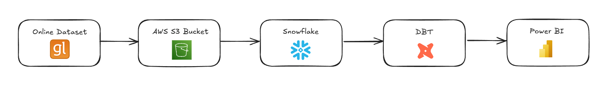
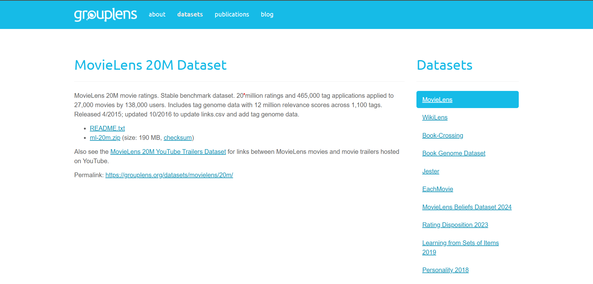
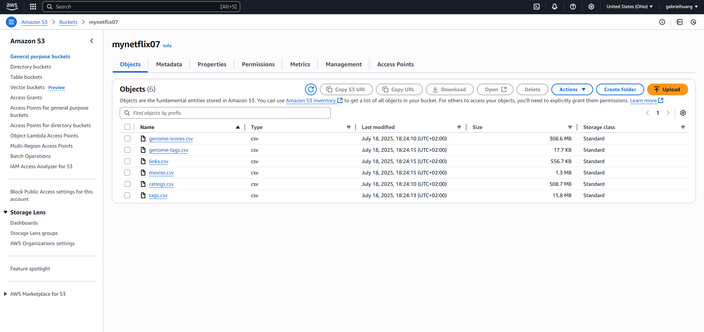
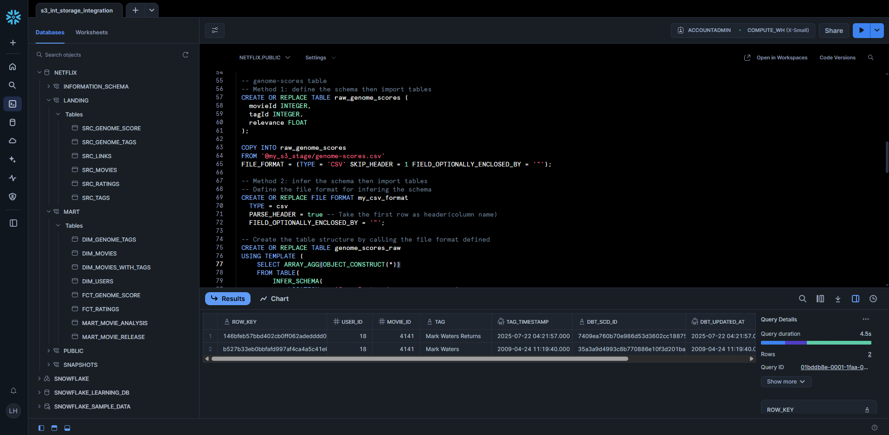
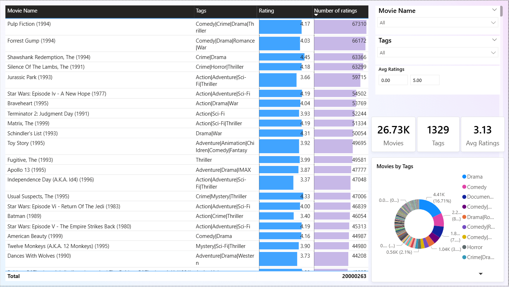

This project focuses on analyzing Netflix movie ratings using the [`MovieLens 20M dataset`](https://grouplens.org/datasets/movielens/20m/). The goal is to gain insights into user preferences, movie popularity, and rating trends.

**Data Pipeline Overview:**

1. **Online Dataset**: The raw data is sourced from the `MovieLens` website.

2. **AWS S3 (Raw Data Storage)**: The dataset is uploaded and stored securely in an `AWS S3` bucket.

3. **Snowflake (Data Warehouse)**: Data is ingested from S3 into `Snowflake`, where it is organized and managed for efficient querying.

4. **DBT (Data Transformation)**: `DBT` is used to transform, clean, and model the data within Snowflake, preparing it for analysis.
5. **Power BI (Data Visualization)**: The transformed data is visualized in `Power BI`, enabling interactive dashboards and reports.
